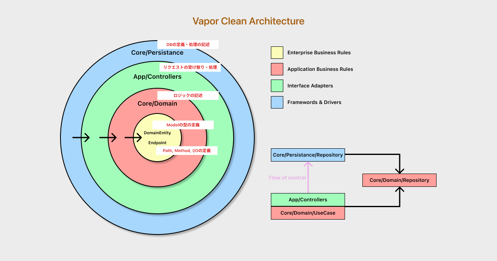
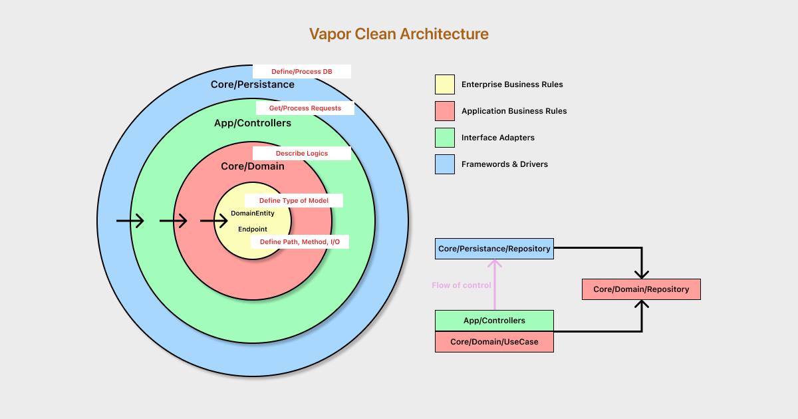

# Vapor × Clean Architecture

Hello. This is a Vapor 4.5 × Clean Architecture Template.<br>

✅ Develop Fast & Safety.<br>
✅ Use async/await.<br>
✅ Multi-package based design for separating responsibilities.<br>
✅ You can share Endpoint and DomainEntity codes with your iOS Clients.<br>
✅ TDD with UseCase Unit Testing and Controller E2E Testing.<br>

<br>

## Get Started

```
$ vapor new <project name> --template=masatsch/vapor-clean-architecture
```

<br>

## Run

```
$ cp .env.development{.sample,}
$ docker-compose up -d db
$ open Package.swift
```

go ` edit scheme > Run > Options `, then turn on ` Use custom working directory `(set current directory path)

then command `cmd + r`

<br>

## Test Controller

```
$ cp ./Tests/.env.testing{.sample,}
$ open Package.swift
```

then command `cmd + u`

<br>

## Test UseCase

```
$ cd Modules/Core
$ open Package.swift
```

then command `cmd + u`

<br>

## Architecture




